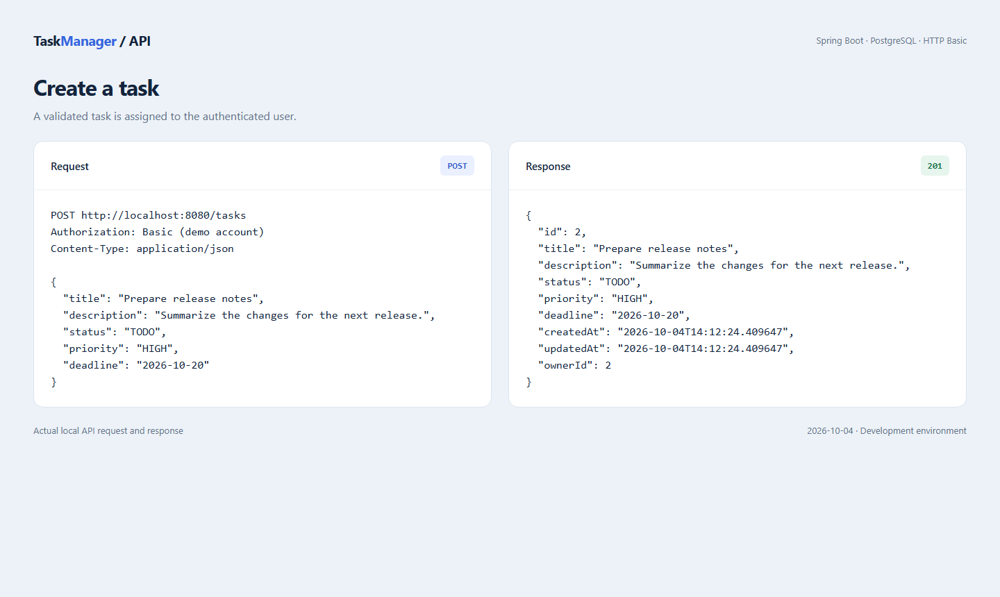
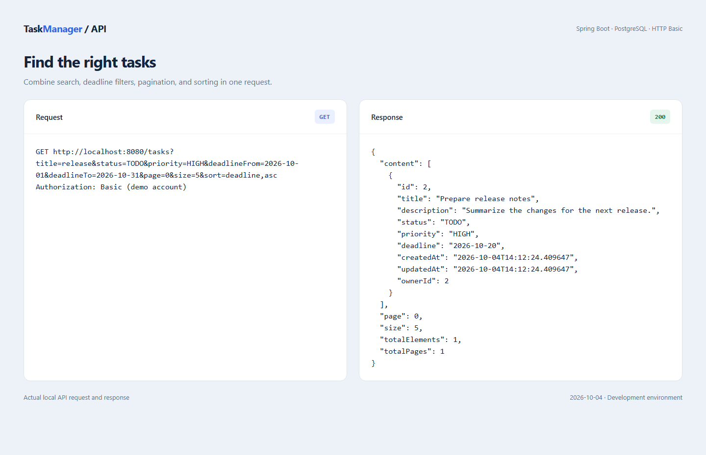
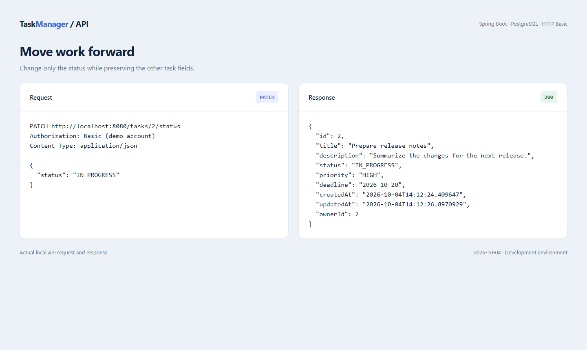
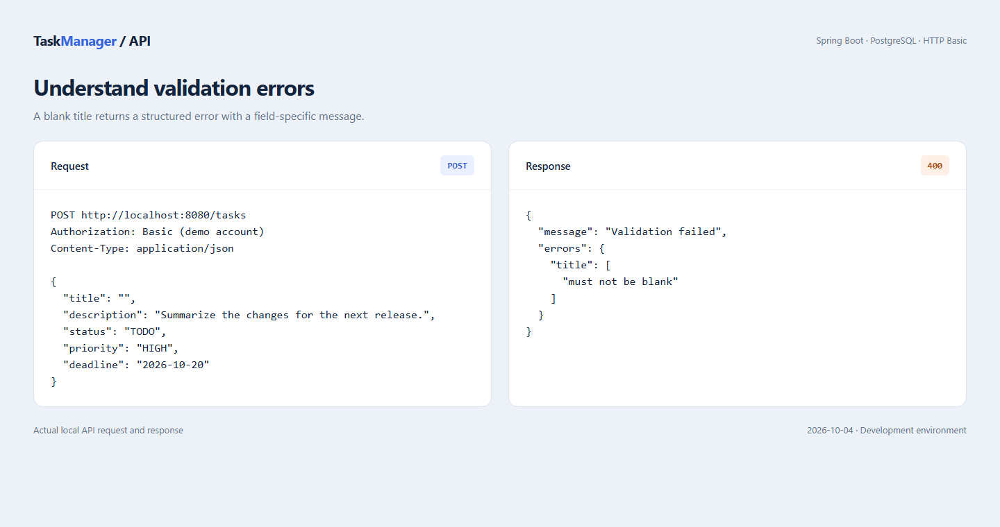

# TaskManager

[](https://github.com/Krzywda98/TaskManager/actions/workflows/ci.yml)

A Spring Boot REST API for managing personal tasks. Users can register, manage their accounts, and create, search, update, and delete their own tasks. Administrators can manage all users and tasks.

**Stack:** Java 17 · Spring Boot 4.1.1 · Spring Security · Spring Data JPA · PostgreSQL 18 · Flyway · Maven · Docker Compose · GitHub Actions



Screenshots are browser-rendered request/response reports captured from the running API. They show real HTTP results, rather than a frontend or Postman interface. IDs and timestamps depend on your database.

## Contents

- [Features](#features)
- [Getting started](#getting-started)
- [Running in IntelliJ IDEA](#running-in-intellij-idea)
- [Authentication and permissions](#authentication-and-permissions)
- [API reference](#api-reference)
- [Try the API](#try-the-api)
- [Filtering, pagination, and sorting](#filtering-pagination-and-sorting)
- [Validation and errors](#validation-and-errors)
- [Database and migrations](#database-and-migrations)
- [Testing and CI](#testing-and-ci)
- [Project structure](#project-structure)
- [Troubleshooting](#troubleshooting)
- [License](#license)

## Features

- Public registration with BCrypt password hashing.
- Stateless HTTP Basic authentication and `USER` / `ADMIN` permissions.
- Ownership checks for tasks and accounts.
- Task statuses: `TODO`, `IN_PROGRESS`, `COMPLETED`.
- Task priorities: `LOW`, `MEDIUM`, `HIGH`.
- Search by title, status, priority, and inclusive deadline range.
- Pagination and sorting with deterministic ordering for equal sort values.
- A dedicated endpoint for changing only a task's status.
- Request validation and a consistent JSON error format.
- Versioned Flyway migrations and integration tests on H2 and PostgreSQL.

## Getting started

### Requirements

- JDK 17 or newer, with `JAVA_HOME` pointing to the JDK directory.
- Docker Desktop running Linux containers, with Docker Compose available.
- Git and optionally IntelliJ IDEA for the included Spring Boot configuration.

Maven is downloaded by the included wrapper; a separate installation is unnecessary.

### 1. Clone the repository

```shell
git clone https://github.com/Krzywda98/TaskManager.git
cd TaskManager
```

### 2. Create your local configuration

Windows PowerShell:

```powershell
Copy-Item .env.example .env
```

macOS / Linux:

```bash
cp .env.example .env
```

Edit `.env` before the first database startup:

```dotenv
DB_USERNAME=taskmanager
DB_PASSWORD=taskmanager_local_password
DB_PORT=5433
```

Use your own local password. `.env` is ignored by Git. The database password is separate from an API user's password. The `local` Spring profile imports `.env` as a Java properties file; keep the simple, unquoted `KEY=value` format shown in `.env.example`.

### 3. Start PostgreSQL

```shell
docker compose up -d --wait
docker compose ps
```

Compose creates the `taskmanager` database at `localhost:5433`. Port `5433` keeps it separate from a PostgreSQL installation using port `5432`.

### 4. Start the API

Windows PowerShell:

```powershell
.\mvnw.cmd spring-boot:run '-Dspring-boot.run.profiles=local'
```

macOS / Linux:

```bash
bash ./mvnw spring-boot:run -Dspring-boot.run.profiles=local
```

The API runs at **http://localhost:8080**. Flyway applies schema migrations on startup, and Hibernate validates the resulting schema. Continue with [Try the API](#try-the-api) to register your first user.

## Running in IntelliJ IDEA

1. Open the repository and import `pom.xml` as a Maven project.
2. Select a JDK 17 or newer as the project SDK.
3. Create `.env` and start the database as described above.
4. Select **TaskManager Docker** in the run configuration selector.
5. Click **Run**.

The shared configuration in [`.run/TaskManager Docker.run.xml`](.run/TaskManager%20Docker.run.xml) activates the `local` profile and sets the project root as the working directory. Credentials are read from `.env`; they are not stored in the shared configuration.

If an older `TaskManagerApplication` configuration is present, select **TaskManager Docker** for the Compose database. The older configuration may still use another PostgreSQL instance.

For a database outside Compose, run without `local` and provide the environment variables `DB_URL`, `DB_USERNAME`, and `DB_PASSWORD`.

## Authentication and permissions

`POST /users` is public. All other endpoints require HTTP Basic authentication with the user's **email** and password. There is no separate login endpoint or token exchange; send credentials with each request. In Postman, select **Authorization > Basic Auth**. In curl, use `--user 'alex@example.com:Secret1!'`.

| Operation | USER | ADMIN |
| --- | --- | --- |
| Read, update, or delete an account | Own account | Any account |
| List all users or change roles | Forbidden | Allowed |
| List tasks | Own tasks | All tasks |
| Read, update, or delete a task | Own tasks | Any task, including unassigned tasks |
| Create a task | Assigned to self | Assigned to self or another existing user |

Registration always creates a `USER`. Passwords and hashes are excluded from responses. Deleting an account also deletes its tasks. For deployment outside your local machine, serve Basic authentication over HTTPS. The project currently provides a backend API without a web frontend or JWT authentication.

## API reference

Base URL: `http://localhost:8080`. JSON requests use `Content-Type: application/json`.

### Users

| Method | Endpoint | Purpose | Success |
| --- | --- | --- | --- |
| POST | `/users` | Register a user | `201 Created` |
| GET | `/users` | List all users; admin only | `200 OK` |
| GET | `/users/{id}` | Read an account | `200 OK` |
| GET | `/users/email?email={email}` | Find an account by email | `200 OK` |
| PUT | `/users/{id}` | Update account fields and optionally password | `200 OK` |
| PUT | `/users/{id}/role` | Change role; admin only | `200 OK` |
| DELETE | `/users/{id}` | Delete an account and its tasks | `204 No Content` |

### Tasks

| Method | Endpoint | Purpose | Success |
| --- | --- | --- | --- |
| GET | `/tasks` | List, filter, and paginate accessible tasks | `200 OK` |
| GET | `/tasks/{id}` | Read a task | `200 OK` |
| POST | `/tasks` | Create a task | `201 Created` |
| PUT | `/tasks/{id}` | Update task fields | `200 OK` |
| PATCH | `/tasks/{id}/status` | Update only the status | `200 OK` |
| DELETE | `/tasks/{id}` | Delete a task | `204 No Content` |

User responses contain `id`, `name`, `surname`, `email`, `role`, and `joinDate`. Task responses contain `id`, `title`, `description`, `status`, `priority`, `deadline`, `createdAt`, `updatedAt`, and `ownerId`.

## Try the API

JSON request files are in [`docs/examples`](docs/examples). These curl commands use Bash syntax. In PowerShell, use `curl.exe`, put each command on one line, and omit the trailing Bash `\` characters. File-based request bodies avoid shell-specific JSON quoting.

### 1. Register a user

```bash
curl -i --request POST 'http://localhost:8080/users' \
  --header 'Content-Type: application/json' \
  --data-binary '@docs/examples/register-user.json'
```

```json
{
  "name": "Alex",
  "surname": "Morgan",
  "email": "alex@example.com",
  "password": "Secret1!"
}
```

The response is `201 Created` with the new account's ID and role. Save the ID for account requests. Reusing the same email returns `409 Conflict`.

### 2. Create a task

```bash
curl -i --request POST 'http://localhost:8080/tasks' \
  --user 'alex@example.com:Secret1!' \
  --header 'Content-Type: application/json' \
  --data-binary '@docs/examples/create-task.json'
```

```json
{
  "title": "Prepare release notes",
  "description": "Summarize the changes for the next release.",
  "status": "TODO",
  "priority": "HIGH",
  "deadline": "2026-10-20"
}
```

Example response shape (`201 Created`):

```json
{
  "id": 1,
  "title": "Prepare release notes",
  "description": "Summarize the changes for the next release.",
  "status": "TODO",
  "priority": "HIGH",
  "deadline": "2026-10-20",
  "createdAt": "2026-10-04T14:00:00",
  "updatedAt": "2026-10-04T14:00:00",
  "ownerId": 1
}
```

Use the returned task ID in subsequent requests; it may differ from `1`. Omit `ownerId` to assign a new task to yourself. An admin can supply another existing user's positive ID. Titles must be unique across the database, including other users' tasks.

### 3. Find tasks

```bash
curl -i --get 'http://localhost:8080/tasks' \
  --user 'alex@example.com:Secret1!' \
  --data-urlencode 'title=release' \
  --data-urlencode 'status=TODO' \
  --data-urlencode 'priority=HIGH' \
  --data-urlencode 'deadlineFrom=2026-10-01' \
  --data-urlencode 'deadlineTo=2026-10-31' \
  --data-urlencode 'page=0' \
  --data-urlencode 'size=5' \
  --data-urlencode 'sort=deadline,asc'
```



The response wraps tasks in `content` with `page`, `size`, `totalElements`, and `totalPages`. Pages are zero-based; a page beyond the results returns empty `content`.

### 4. Change only the status

```bash
curl -i --request PATCH 'http://localhost:8080/tasks/1/status' \
  --user 'alex@example.com:Secret1!' \
  --header 'Content-Type: application/json' \
  --data-binary '@docs/examples/update-status.json'
```

```json
{
  "status": "IN_PROGRESS"
}
```

The response is `200 OK` with the updated task. Other task fields are preserved.



### 5. Update or delete a task

```bash
curl -i --request PUT 'http://localhost:8080/tasks/1' \
  --user 'alex@example.com:Secret1!' \
  --header 'Content-Type: application/json' \
  --data-binary '@docs/examples/update-task.json'
```

`PUT` requires `title`, `description`, `status`, and `priority`. An omitted or null `deadline` clears it. Omitting `ownerId` preserves the existing owner during an update; an admin can supply an existing user's ID to reassign the task.

```bash
curl -i --request DELETE 'http://localhost:8080/tasks/1' \
  --user 'alex@example.com:Secret1!'
```

Successful deletion returns `204 No Content` without a response body.

### 6. Read or update your account

```bash
curl -i 'http://localhost:8080/users/1' \
  --user 'alex@example.com:Secret1!'
```

```bash
curl -i --request PUT 'http://localhost:8080/users/1' \
  --user 'alex@example.com:Secret1!' \
  --header 'Content-Type: application/json' \
  --data-binary '@docs/examples/update-user.json'
```

Use your actual account ID. An update requires `name`, `surname`, and `email`. Omit `password` to retain it. After changing your email or password, use the new credentials.

### Administrator access for local development

There is no default administrator or public admin-registration endpoint. To explore admin requests locally, register an account, then promote that specific account in your development database:

```shell
docker compose exec postgres psql -U taskmanager -d taskmanager -c "UPDATE users SET role = 'ADMIN' WHERE email = 'alex@example.com';"
```

Replace the username after `-U` if your `.env` uses another one. That account can now call admin-only endpoints with its existing Basic credentials:

```bash
curl -i 'http://localhost:8080/users' \
  --user 'alex@example.com:Secret1!'
```

To change another existing user's role, use their ID:

```bash
curl -i --request PUT 'http://localhost:8080/users/2/role' \
  --user 'alex@example.com:Secret1!' \
  --header 'Content-Type: application/json' \
  --data-binary '@docs/examples/update-role.json'
```

## Filtering, pagination, and sorting

Filters combine with AND and always respect the authenticated user's permissions.

| Parameter | Default | Values / behavior |
| --- | --- | --- |
| `status` | None | `TODO`, `IN_PROGRESS`, `COMPLETED` |
| `priority` | None | `LOW`, `MEDIUM`, `HIGH` |
| `title` | None | Case-insensitive substring; trims surrounding whitespace; ignores blank text |
| `deadlineFrom` | None | Inclusive lower bound, `YYYY-MM-DD` |
| `deadlineTo` | None | Inclusive upper bound, `YYYY-MM-DD` |
| `page` | `0` | Integer greater than or equal to zero |
| `size` | `20` | Integer from `1` to `100` |
| `sort` | `id,asc` | One `field,direction` pair; direction `asc` or `desc` |

Sort fields: `id`, `title`, `deadline`, `createdAt`, `updatedAt`. Other fields add ascending `id` as a tie-breaker. Enum values are case-sensitive. Deadline filters exclude undated tasks; `deadlineFrom` must not exceed `deadlineTo`. Title search treats `%`, `_`, and `!` literally.

## Validation and errors

| Field | Rule |
| --- | --- |
| User `name` | Required, nonblank, 3–12 characters |
| User `surname` | Required, nonblank, 3–10 characters |
| User `email` | Required, valid email, 3–50 characters, unique |
| User `password` | Required on registration; optional on update; 6–10 characters with uppercase, lowercase, a digit, and at least one of `@#$%^&+=!` |
| Task `title` | Required, nonblank, at most 100 characters, globally unique |
| Task `description` | Required, nonblank, at most 500 characters |
| Task `status`, `priority` | Required, valid enum values |
| Task `deadline` | Optional, ISO date `YYYY-MM-DD` |
| Task `ownerId` | Optional, positive integer; assignment requires permission |

Unknown JSON properties are rejected. Do not submit server-managed fields such as IDs, timestamps, or a role during registration.

| Status | Meaning |
| --- | --- |
| `400` | Invalid body, validation failure, invalid enum/date, or invalid list parameters |
| `401` | Missing or invalid Basic credentials |
| `403` | Authenticated user lacks permission |
| `404` | Requested resource does not exist |
| `409` | Duplicate email/title or another database constraint conflict |

Errors contain `message` and `errors`. Field validation failures include arrays of messages keyed by field name:

```json
{
  "message": "Validation failed",
  "errors": {
    "title": ["must not be blank"]
  }
}
```

Try a validation failure:

```bash
curl -i --request POST 'http://localhost:8080/tasks' \
  --user 'alex@example.com:Secret1!' \
  --header 'Content-Type: application/json' \
  --data-binary '@docs/examples/invalid-task.json'
```



Unauthenticated `GET /tasks` returns `401` with `{"message":"Authentication required","errors":{}}`.

## Database and migrations

Compose runs PostgreSQL; Java runs in IntelliJ or through Maven. The named `postgres_data` volume is mounted at `/var/lib/postgresql`, matching the PostgreSQL 18 image layout.

| Setting | Purpose |
| --- | --- |
| `DB_USERNAME`, `DB_PASSWORD` | PostgreSQL credentials used by Compose and the application |
| `DB_PORT` | Local Compose port; defaults to `5433` for `local` |
| `DB_URL` | Full JDBC URL when running without `local` |

Migrations live in [`src/main/resources/db/migration`](src/main/resources/db/migration). `V1__create_users_and_tasks.sql` creates the schema, relationships, and constraints. Add a new versioned migration for future schema changes. Hibernate uses `ddl-auto=validate`.

```shell
docker compose logs -f postgres
```

To stop and remove the container:

```shell
docker compose down
```

The volume is retained; users and tasks remain after the next startup. Credentials are initialized when the volume is first created. Editing `.env` later does not automatically change the existing database user's password.

## Testing and CI

### H2 integration tests

Windows PowerShell:

```powershell
.\mvnw.cmd --batch-mode --no-transfer-progress verify
```

macOS / Linux:

```bash
bash ./mvnw --batch-mode --no-transfer-progress verify
```

The default test configuration uses in-memory H2 in PostgreSQL compatibility mode and applies Flyway migrations. The current suite contains 36 tests, including the application context check.

### PostgreSQL integration tests

Use the dedicated **`taskmanager_test`** database. Tests delete users and tasks; do not point them at your development database.

Create it once per volume, using your `.env` username:

```shell
docker compose exec postgres createdb -U taskmanager taskmanager_test
```

If it already exists, proceed to running the tests. Windows PowerShell, with credentials matching `.env`:

```powershell
$env:TEST_DB_USERNAME='taskmanager'
$env:TEST_DB_PASSWORD='taskmanager_local_password'
.\mvnw.cmd --batch-mode --no-transfer-progress '-Dspring.profiles.active=postgres-test' '-Dspring.datasource.url=jdbc:postgresql://localhost:5433/taskmanager_test' verify
```

macOS / Linux:

```bash
TEST_DB_USERNAME=taskmanager TEST_DB_PASSWORD=taskmanager_local_password \
  bash ./mvnw --batch-mode --no-transfer-progress \
  -Dspring.profiles.active=postgres-test \
  -Dspring.datasource.url=jdbc:postgresql://localhost:5433/taskmanager_test verify
```

Adjust the port if you changed `DB_PORT`. Activate only `postgres-test`; `local` is for the development database.

### GitHub Actions

The [CI workflow](.github/workflows/ci.yml) runs on every push, on pull requests to `main`, and manually. Separate jobs run Maven `verify` with Java 17 on H2 and PostgreSQL 18. The PostgreSQL job starts its own test database. Reports are uploaded as artifacts and retained for seven days. Local reports are in `target/surefire-reports`.

## Project structure

```text
.github/workflows/          GitHub Actions CI
.run/                      Shared IntelliJ run configuration
docs/examples/             JSON request bodies
docs/screenshots/           Screenshots of real API results
src/main/java/com/example/taskmanager/
  config/                  Security configuration
  controllers/             HTTP endpoints
  exceptions/              Error handling
  models/                  Entities, DTOs, and enums
  repositories/            JPA repositories
  services/                Business logic and authorization
src/main/resources/
  db/migration/            Flyway SQL migrations
  application.properties   Common configuration
  application-local.properties
src/test/                  Integration tests and database profiles
compose.yaml               Local PostgreSQL service
.env.example               Local environment template
pom.xml                    Dependencies and build configuration
```

## Troubleshooting

| Symptom | What to check |
| --- | --- |
| Docker cannot connect to its engine | Start Docker Desktop and wait for the Linux engine. On Windows, ensure WSL 2 is installed. |
| `docker` is not recognized | Reopen the terminal or IntelliJ after installation so PATH is refreshed. |
| Port `5433` is occupied | Change `DB_PORT` in `.env` and recreate the container. `local` reads the new port. |
| `.env` cannot be found | Copy `.env.example` to `.env` and run from the project root. |
| Database authentication fails | Use the password from the volume's first initialization; editing `.env` alone does not change it. |
| Invalid `JAVA_HOME` | Point it at a JDK directory, not its `bin` subdirectory. |
| API returns `401` | Register and use the account's email and password, not PostgreSQL credentials. |
| Task creation returns `409` | Choose a title that is not already in the database. |
| Root URL shows no webpage | This is a REST API. Call `/users` or `/tasks` with the correct method and authentication. |

References: [Spring Boot configuration](https://docs.spring.io/spring-boot/reference/features/external-config.html), [IntelliJ run configurations](https://www.jetbrains.com/help/idea/run-debug-configuration-spring-boot.html), [Docker PostgreSQL guide](https://docs.docker.com/guides/postgresql/).

## License

Licensed under the [MIT License](LICENSE). Copyright (c) 2026 Krzywda98.
